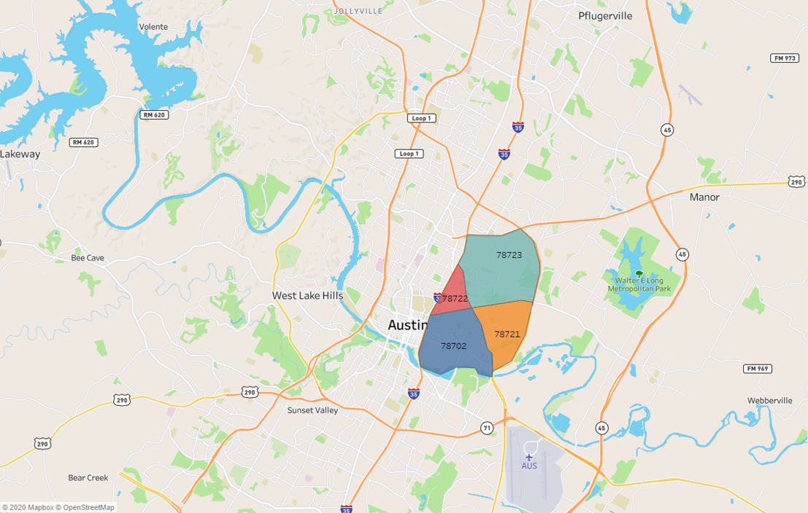

# Gentrification in East Austin from 2015-2019

## Hypothesis: 
Poverty will be more concentrated in East Austin in 2015 as compared to the rest of the city, and as time goes on, the poverty level in East Austin will decrease as gentrification pushes people out of Austin altogether. 
      

      
### Our Questions for Gentrification in East Austin (i.e. measures of gentrification):
1. How have housing values changed over time? 
2. Is there more Section 8 housing (government assisted housing) and are the numbers of units increasing? 
3. What does the school data say about demographics and poverty?
4. What permits are issued by the city and what do they indicate about poverty?
      

### Definition of East Austin:
Zip Codes: 78721, 78702, 78722, 78723  

      

#### House Values
https://public.tableau.com/profile/tyler.pohl#!/vizhome/ProjectOneHouseingData/Story2?publish=yes 

According to the data, East Austin and Austin as a whole has experienced an increase in average home value. When looking specifically at East Austin, we see some of the largest growth in the area that far outpaces the national average for increase in home value. In relation to our hypothesis and according to the data, it appears poverty in East Austin has been pushed out almost entirely. 

    

#### Section 8 Housing
https://public.tableau.com/profile/jessica.bates#!/vizhome/Section8AustinHousingAnalysis-Final/Analysis?publish=yes  

There is not a higher concentration of Section 8 housing (government assisted housing) on the east side when compared to the rest of Austin, either by number of units or density of units. Also, as time goes on, more units are added to the outskirts of the city.

    

#### School data: Ethnicity and Academic Performance 
https://public.tableau.com/profile/amy.b1588#!/vizhome/EastAustinSchoolsAnalysis/SchoolsStory   

###### Ethnic Distribution: 
East Austin schools have traditionally had a Hispanic majority. But during the 5 years evaluated, there was a 5% drop in Hispanics, 1% drop in African Americans, but a 5% rise in White enrollment. This clearly deviated from the rest of Travis County.Both trends deviate from other Travis County schools, and indicate a demographic shift in East Austin.

###### Academic Performance (STAAR test results): 
STAAR test passing rates were relatively unchanged for Hispanics and African Americans. But White students in East Austin showed a significant rise of 30%, almost catching up with the rest of Travis County for White students. This could be a possible outcome of kids from higher income households with access to better support and more resources coming into schools in the area (assuming at least some join the public school system in AISD).

The above findings support part of our hypothesis, showing certain ethnic groups getting pushed out of East Austin and getting replaced possibly by more affluent groups as part of the gentrification cycle in the East Austin neighborhood.
    

#### School Data: Free and Reduced Lunch
https://public.tableau.com/profile/alicia.pelkey#!/vizhome/SchoolDataStarters/PovertyLevelsinAustinISDSchools?publish=yes  
    

#### Construction Permits

https://public.tableau.com/profile/priyanka.garg2578#!/vizhome/EastAustinPermits/Story2?publish=yes

https://public.tableau.com/profile/maria.alzaga#!/vizhome/AustinPermits_16017283195670/AustinPermits?publish=yes

According to the data, East Austin and Austin as a whole has experienced an increase in permits issued. Overall there is a constant growth is seen in the areas of residential sector in year 2018-2019 in zipcode 78702 and 78722. Based on dataset available - yes, there is a small % change has been seen in some parts but due to lack of data available in some parts of east austin and commercial construction permits have decreased, which disproves the hypothesis, the poverty level in East Austin with time is unpredictable.
      

## Conclusion

There is more poverty on the east side when looking at some aspects: The house prices are lower on the east side than the rest of the city and east of 35 there are more low income students in schools. However, there is not a higher concentration of Section 8 housing on the east side, which disproves the hypothesis. 

There are many aspects that show evidence of gentrification: House prices in east Austin are increasing, certain ethnic groups are being pushed out and (probable) higher income households and ethnicities are replacing them, Section 8 housing is being pushed to the outskirts of the city, and there is an increased amount of residential construction permits. However, there is not a decline in schools for students who are in low income households on the east side and commercial construction permits have decreased, which disproves the hypothesis. 

     

      

#### Technologies Used
- Python  
- Pandas  
- Tableau  
- Jupyter Notebook  
- Google Maps Platform Geocoding API  
      

#### Actions and Tasks
Find and clean the data.  
Explore and visualize the data.  
Determine if the data proves or disproves the hypothesis.  
      

##### Main Data Sources: 
1. Income and house values: https://www.bridgeinteractive.com/developers/bridge-api/  
2. Section 8 housing: https://data.austintexas.gov/Housing-and-Real-Estate/City-of-Austin-Affordable-Housing-Inventory-AHI-/x5p7-qyuv/data  
3. Schools: https://tea.texas.gov/ , https://data.texas.gov/  
4. City permits: https://data.austintexas.gov/Building-and-Development/Issued-Construction-Permits/3syk-w9eu  

      

#### Limitations of Our Data
1. Free and reduced lunch data was not available for 2014 - 2015 school year.
2. The school data was structured in terms of school years (August to May), but the other data was structured traditionally (January to December).
3. No relavant data was available for zipcode 78762, a small area embedded within 78702. 

##### Team Members: Maria Alzaga, Amy Banerji, Jessica Bates, Priyanka Garg, Alicia Pelkey, and Tyler Pohl

##### UT Data Analysis & Visualization Bootcamp | October 2020
